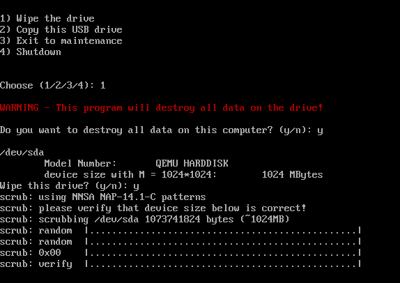

# Super Drive Wipe
## NIST 800-88 drive sanitization Tool version 1.1

https://github.com/sensei-hacker/super_drive_wipe

Created by Ray Morris

## Purpose this tool
This flash drive can be used to sanitize / wipe hard drives.
This tool is compliant with NIST 800-88 and will use the strongest method
available for each type of storage.

Drive sanitizing should be done before disposing of a hard drive / computer, and before
giving a computer to a different employee of a different security group.

Writing zeros (or any other pattern) from user space is _NOT_ a secure method
of wiping modern drives, including SSD and NVME drives. Modern drives contain
sanitize functions in the onboard drive frimware that is both more secure and 
significantly faster. Super Drive Wipe uses these modern sanitize methods for 
secure data wiping.

This tool supports ATA, SATA, and nvme drives, including drives using M.2 connectors.

Super Drive Wipe supportd the following wipe methods:
* SATA security-erase
* SATA security-erase-enhanced
* SATA sanitize block erase
* SATA sanitize crypto scramble
* nNSA scrub
* NVME format user data erase
* NVME block erase
* NVME crypto erase

## Installation

The easiest way to use the tool is to download the prebuilt boot image here:
https://super-drive-wipe.s3.amazonaws.com/super-drive-wipe.rar

The included ImageWriter.exe is one way to burn the image to a USB flash drive 
in Windows. The .img file in the zip file should be burned to a USB flash
drive or other disk. It cannot be simply copied as a file, but needs to be burned
as an image.

Burning this drive wipe tool to a drive will destroy any existing data on the 
flash drive.

The included liveusb-creator.zip can also be used instead to burn the image to
a flash drive. Just unzip liveusb-creator.zip and run the exe.

From Linux or Mac, the image can be burned to a flash drive with a command such as:
dd if=disk_wipe.img bs=1M of=/dev/sdX

Where sdX is the new flash drive. be very careful to choose the correct drive, as dd
WILL wipe all data from the destination!

The image can also be booted in Virtualbox or Qemu as a VHD file.

One may also use the script bin/wipe_drives from any Linux installation.
hdparm and nvme utils must be installed. If using your own existing Linux
installation, it is important to be very careful not to wipe the wrong drive!

## USAGE

Insert the flash drive containing this tool into the USB of a computer which is to be wiped.
Boot to the flash drive. On Dell computers, you may press F12 during boot in order to 
select to boot from USB. Note the USB stick may be detected as a hard drive rather than as
"removeable media".  Be sure to check under hard drives if you don't see it listed under 
removeable media.

On UEFI systems, from the UEFI screen select "Wipe Drives", "CentOS", or partition 5.
At the boot loader screen, press the down arrow key to select UEFI mode.

Once it boots, just follow the menu prompts on the screen. Note it will wipe out any data
on the target drive, with no possiblity of ever recovering the data.

On most SSDs, sanitization will take about 60 seconds or so. Rotating magnetic media can 
take hours.

## Copying this tool

The easiest way to copy this bootable USB drive to use one copy of this bootable flash 
drive to create a copy of itself. Simply boot from this existing drive and select 
the menu option to make another copy. The new flash drive on which you are installing
must be at least 1GB.

## Recovering Data Wiped by Super Drive Wipe
Lol no.
If you accidentally wiped the wrong drive, there is absolutely nothing anyone can do
to recover the data from that drive. It's irretrievably gone. Maybe check your Onedrive
or other cloud service to see if the data you need was also copied there.

## Customizations for this tool
This tool is created by deepmagicbeginshere@gmail.com

It consists of a Linux installation on the thumb drive which runs /usr/local/bin/wipe_drives
on boot. This Linux uses the kernel and initrd modified from CentOS 7, but does not have RPM and yum.
Developers may update the tool (such as for NVMe) by running the image as a virtual machine.
The wipe script itself may also be edited from Windows by using Notepad, it exists as wipe_drives.txt 
in the Windows-accessible partition.
Additionally, updates can be performed by writing a shell script to the "update.txt" file.
That file will be run on each boot.

https://github.com/sensei-hacker/super_drive_wipe

